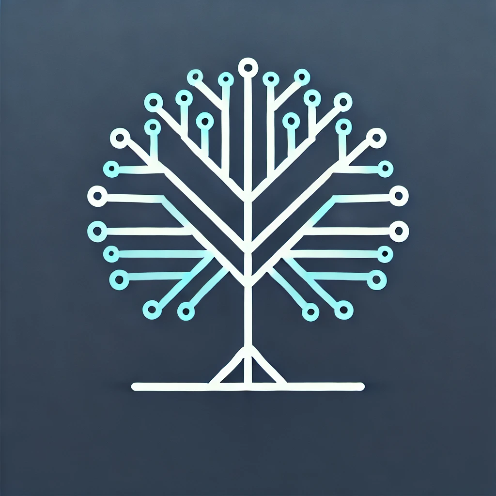

<div align="center">
  <a href="https://github.com/goer17/InnoTree">
    
  </a>
<h3 align="center">InnoTree: Integrating MCTS with Language Models for Scientific Idea Generation</h3>
  <p align="center">
    💡 InnoTree is an advanced agent system specifically designed to integrate Monte Carlo Tree Search (MCTS) techniques, enabling the efficient generation and exploration of innovative scientific ideas.
  </p>
</div>


#### 🤗 Introduction

We introduce **InnoTree**, an agent system designed to facilitate the generation and exploration of innovative scientific ideas. InnoTree integrates Monte Carlo Tree Search (MCTS) techniques to efficiently navigate complex idea spaces, systematically identifying and evaluating promising research directions. By leveraging the probabilistic nature of MCTS, the system strikes a balance between **exploration** and **exploitation**, ensuring a comprehensive yet focused search for high-impact scientific concepts. This framework offers a structured approach to idea development, with considerable potential to accelerate interdisciplinary research and foster novel discoveries. Experimental results demonstrate that InnoTree generates more innovative scientific ideas compared to traditional methods.


#### 🌟 Quick Start

**Cloning the repo**

```bash
git clone https://github.com/Goer17/InnoTree.git
```

**Downloading the dependencies**

```bash
conda create -n inno_tree python=3.12 -y && \
conda activate inno_tree
```

```bash
pip install -r requirements.txt
```

**Running**

Create a `.env` file and set your API key :

```sh
CUSTOM_API_KEY=
CUSTOM_BASE_URL=

OPENAI_API_KEY=
OPENAI_BASE_URL=https://api.openai.com/v1

GROK_API_KEY=
GROK_BASE_URL=https://api.grok.com/v1

DEEPSEEK_API_KEY=
DEEPSEEK_BASE_URL=https://api.deepseek.com

# ...
```

```bash
python main.py --topic "Multi Agent System" \ # choose the target topic
    --model "gpt-4o-mini" \
    --n_rollouts 10 \
    --n_trials 20 \
    --n_exp 3 \
    --n_results 5 \
    --arena \
    --sampling best
```

**Client-Server Model**

Alternatively, you can run the application in a client-server model :

```python
python app.py
```

Then, use `curl` to send a POST request to the server :

```bash
curl -X POST http://127.0.0.1:5000/start \
     -H "Content-Type: application/json" \
     -d '{
           "topic": "Target topic",
           "api_key": "Your API key",
           "base_url": "Your base url",
           "model": "Your model",
           "sampling_method": "best", # Decoding method: best, epsilon, v-epsilon
           "exploration_weight": 1.5,
           "n_trials": 15,
           "n_rollouts": 12,
           "n_expand": 3
         }'
```

You can retrieve your task ID from the response and then use it to stream the results :

```bash
curl -X GET http://127.0.0.1:5000/stream\?task_id\="Your task id"
```


#### 👀 Visualization

We’ve also developed a lightweight GUI using Vue.js to visualize the search path of **InnoTree**. This interface provides insight into how the Monte Carlo Tree Search (MCTS) algorithm operates, showing how it explores and updates the value of each node during the process.

To set up the front-end, navigate to the `inno-tree-web` directory and install the required dependencies :

```bash
cd inno-tree-web && npm install
```

Start the front-end development server:

```bash
npm run dev
```

To run the back-end server, navigate back to the root directory and start the application :

```bash
cd .. && python app.py
```


Once everything is running, you can access the application at http://127.0.0.1:5173


